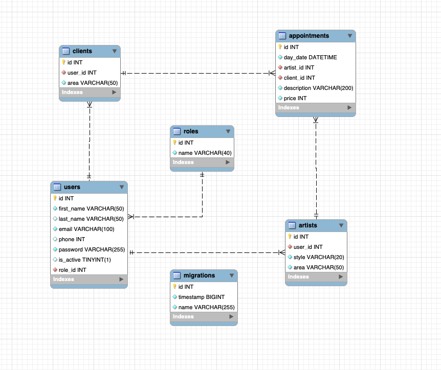

# Studio Tattoos Backend database

<details>
  <summary>Contenido 📝</summary>
  <ol>
    <li><a href="#objetivo">Objetivo</a></li>
    <li><a href="#sobre-el-proyecto">Sobre el proyecto</a></li>
    <li><a href="#stack">Stack</a></li>
    <li><a href="#diagrama-bd">Diagrama</a></li>
    <li><a href="#instalación-en-local">Instalación</a></li>
    <li><a href="#endpoints">Endpoints</a></li>
    
  </ol>
</details>

## Objetivo
Desde el departamento de producto nos piden crear el backend
correspondiente al sistema de gestión de citas para un estudio de tatuajes.
Para ello el cliente deberá ser capaz de registrarse en la aplicación, hacer
login y acceder a su área de cliente, todo ello visualmente desde el navegador. En
su área de cliente deberá poder ver una lista de las citas para sesiones de tattoo /
piercing que tiene a futuro, podrá crear citas con tatuadores y cada tatuador tendrá
un portfolio de tatuajes(galeria?), modificarlas y anularlas.
También existirá una zona de usuario con sus datos personales, que solo
podrá ver él mismo.
## Sobre el proyecto
Teniendo en cuenta los requisitos, llegamos a la conclusión de que este sería
el mínimo de endpoints convenientes:

1. Registro de usuarios.
2. Login de usuarios.
3. Perfil de usuario.
4. Modificación de datos del perfil.
5. Creación de citas.
6. Editar citas.
7. Eliminación de citas
8. Ver todas las citas que tengo como cliente (solo las propias).
9. Ver todas las citas existentes conmigo (role tatuador).
10. Listar tatuadores
11. Ver todos los clientes registrados (super admin) (EXTRA)
12. Crear tatuadores (superadmin) (EXTRA)
13. Ver todos los clientes registrados (super admin) (EXTRA)
14. Eliminar usuario del sistema(super admin ) (EXTRA)
15. Ver una cita en detalle (EXTRA).
16. El super_admin debe otorgar roles a los usuarios del sistema(EXTRA)
17. Validar la fecha de la cita(EXTRA)
18. Añadir tipos de intervención (tattoo / piercing ) a las citas (EXTRA)
## Stack
1. Para el desarrollo del backend se utilizará TypeOrm.
2. Debemos usar ES6 o TS, se valorará el dominio sobre las promesas, así como
la funcionalidad de async/await.
3. El proyecto se subirá a un repositorio público de GitHub y se valorará la existencia de ramas o trabajo en features (Git Flow), así como diversos
commits con la evolución del proyecto.

## Diagrama BD


## Instalación en local
### Init project
```sh
npm init -y
```

### Express
```sh
npm i express
```

### TypeScript
```sh
npm i -D typescript
```

### Node types and Express types
```sh
npm i -D @types/node
npm i -D @types/express
```

### Additional modules
```sh

npm i cors
npm i -D @types/cors

npm i -D nodemon
npm i -D ts-node

npm i bcrypt
npm i -D @types/bcrypt

npm i @faker-js/faker

npm i jsonwebtoken
npm i -D @types/jsonwebtoken

npm i dotenv
```

### TypeORM
```sh
npm i typeorm reflect-metadata mysql2
```

### Optional modules
```sh
npm i http-status-codes
npm i colors
```


## ⚙️ Configurations

### Create `tsconfig.json`
```sh
npx tsc --init
```

### Configure `tsconfig.json`
```json
{
    "compilerOptions": {
        "target": "ES2021",
        "experimentalDecorators": true, 
        "emitDecoratorMetadata": true,
        "rootDir": "./src",
        "outDir": "./dist",
    },
    "include": [
        "src/**/*.ts"
    ],
    "exclude": [
        "node_modules"
    ]
}
```

### Initial project structure
```sh
├── ./src
│   ├── config
│   │   ├── app.ts
│   │   ├── cors.ts
│   ├── constants
│   ├── controllers
│   ├── database
│   │   ├── factories
│   │   ├── migrations
│   │   ├── seeders
│   │   └── data-source.ts
│   ├── helpers
│   ├── middlewares
│   ├── models
│   ├── routes
│   ├── services
│   ├── types
│   ├── app.ts
│   └── server.ts
├── ./env
├── ./env-sample
├── ./gitignore
├── ./package.json
├── ./README.md
└── ./tsconfig.json
```

### Configure `package.json`
```json
{
    "main": "dist/server.js",
    "scripts": {
        "build": "tsc",
        "start": "node dist/server.js",
        "dev": "nodemon --files src/server.ts"
    },
}
```

## 📜 Main TypeORM CLI scripts

### Create migrations manually (example)
```sh
npx typeorm migration:create ./src/database/migrations/CreateUsersTable
```

### Execute migrations
```sh
npx typeorm-ts-node-commonjs migration:run -d ./src/database/data-source.ts 
```

### Revert migrations
```sh
npx typeorm-ts-node-commonjs migration:revert -d ./src/database/data-source.ts 
```

### Create models (example)
```sh
npx typeorm entity:create ./src/models/User
```

### Drop database
```sh
npx typeorm-ts-node-commonjs schema:drop -d ./src/database/data-source.ts
```


## Endpoints
<details>
<summary>Endpoints</summary>

- AUTH
    - REGISTER

            POST http://localhost:3000/api/users/create
        body:
        ``` js
            {
                "firstName": "Pepito",
                "lastName": "Pérez",
                "email": "pepito@tattoostudio.com",
                "phone": "123456789",
                "password": "87654321",
                "isActive":"1"
            }
        ```

    - LOGIN

            POST http://localhost:3000/api/auth/login  
        body:
        ``` js
            {
                "email": "pepito@tattoostudio.com",
                "password": "87654321"
            }
        ```
- ADMIN
    - DELETE USER
    
            DELETE http://localhost:3000/api/users/delete/1
    
    - GET DETAIL APPOINTMENTS
    
            GET http://localhost:3000/api/appointments/1
    
    - POST CREATE ARTIST
    
            POST http://localhost:3000/api/artists/create
        body:
        ```js
            {
                "firstName":"Artist test", 
                "email": "artist@tattoo.com", 
                "password": "12345678", 
                "phone": "123456789",
                "style": "tribal"
	        }
        ```

- ARTISTS
        
    - GET ALL ARTISTS
    
            GET http://localhost:3000/api/artists
    
- APPOINTMENTS

    - CREATE APPOINTMENT
    
            POST http://localhost:3000/api/appointments/create
        
        body:
        ```js
            {
                "day_date": "2024-08-03T15:48:02.000Z",
	            "description": "Lorem ipsum.",
	            "artist":5,
	            "client":9,
	            "price": 9734
                
            }
    - GET ALL APPOINTMENTS
        
            GET http://localhost:3000/api/appointments

    - DELETE APPOINTMENT
    
            DELETE http://localhost:3000/api/appointments/4
    
    - GET APPOINTMENT BY ID
    
            GET http://localhost:3000/api/appointments/3

- USER
    
    - UPDATE SELF PROFILE
            
            PUT http://localhost:3000/api/users/edit/2
        body:
        ```js
            {
                "firstName": "Houston",
                "lastName": "Carroll",
                "email": "Dudley_Ledner27@gmail.com",
                "phone": 290867512,
                "isActive": true
            }
        ```
    - GET SELF PROFILE
            
            GET http://localhost:3000/api/users/profile/
    
    - GET ALL USERS
    
            GET http://localhost:3000/api/users/all
    
    - CREATE USER
        
            POST http://localhost:3000/api/users/create
            
        body:
        ```js
            {
                      "firstName": "Pablo",
                      "lastName": "Picapiedra",
                      "email": "pablo.picapiedra@hotmail.coma",
                      "phone": 765933668,
                      "password": "12345678",
                      "isActive": true
            }
        ```
    - GET USER BY ID
    
            GET http://localhost:3000/api/users/4

</details>
